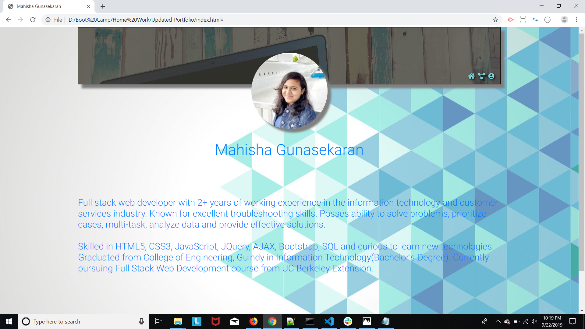
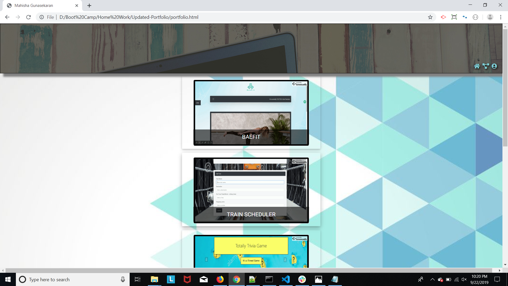
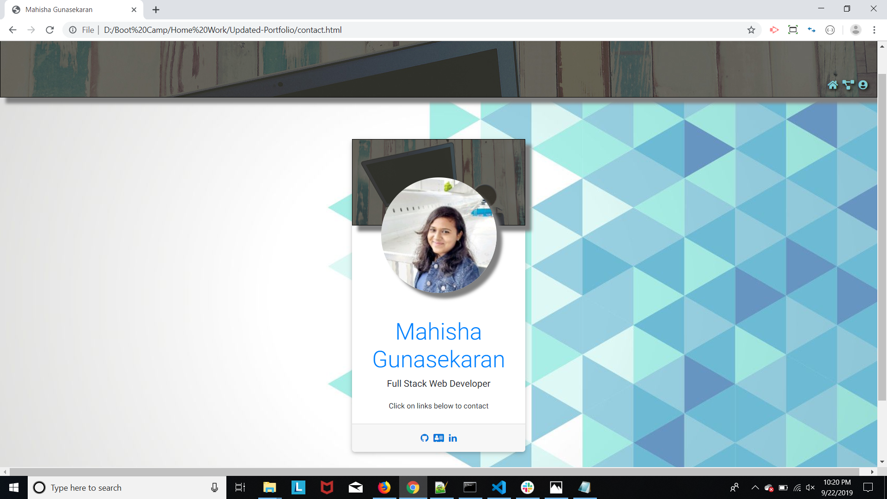

# Updated Portfolio

## Summary
Built a professional portfolio site using HTML/Bootstrap. This website basically has three web pages linked to each other. Applied different concepts like bootstrap, padding, margins to be mobile responsive. Used handlebars to dynamically generate portfolios in portfolio page. Used MySql database to store portfolio details and access them via GET request. Also using `/form` api route, one can input a new portfolio which in turn will be stored to portfolio table. In addition to all these features, one can even delete a portfolio that is no longer needed.

## Technologies Used
- HTML : used to create elements on the DOM
- Bootstrap : to style html pages and to be page responsive
- Git : version control system to track changes to source code
- GitHub : hosts repository that can be deployed to GitHub pages
- Handlebar : To dynamically generate HTML page
- MySql : Relational Database Management
- Sequelize : Promise based Node.js ORM for MySql
- Node : used to run javascript file outside the browser. Supports command line user input. Node is useful is different ways. As
far as this code is concerned, utilised inquirer to dynamically prompt question to user. Used mysql npm package to create schemas.

## Site pictures




## Code Snippet
```Handlebars
{{#each result}}
        <div class="d-inline-flex flex-row bd-highlight mb-3 imgBtn">
            <button type="button" class="btn text-center website modal-trigger" id="imgBtnofBtn"data-id={{id}}>
                
                <div class="text">{{NAME}}</div>
            </button>
        </div>
        {{!-- Modal --}}
        <div class="modal fade" id={{id}} tabindex="-1" role="dialog" aria-labelledby="exampleModalLabel"
            aria-hidden="true">
            <div class="modal-dialog" role="document">
                <div class="modal-content">
                    <div class="modal-header">
                        <h5 class="modal-title" id="exampleModalLabel">{{NAME}}</h5>
                        <button type="button" class="close" data-dismiss="modal" aria-label="Close">
                            <span aria-hidden="true">&times;</span>
                        </button>
                    </div>
                    <div class="modal-body">
                        {{DESC}}
                        <hr>
                        <a href={{LINK}}>{{NAME}}</a>
                    </div>
                    <div class="modal-footer">
                        <button type="button" class="btn btn-secondary" data-dismiss="modal">Close</button>
                    </div>
                </div>
            </div>
        </div>
        {{/each}}
```
> Handlebars to generate images and modal dynamically for each values retrived from database

```Javascript
<!-- The below code snippet is added to my contact card -->
$.ajax("/new/website", {
            type: "POST",
            data: website
        }).then(function(result){
            console.log("Value is inserted to table");
        })
```
> Client side javascript to post a new portfolio

```Javascript
// Portfolio route
router.get("/portfolio", function (req, res) {

    db.Portfolio.findAll({}).then(function (result) {
        console.log(result);
        var obj = {
            result: result
        }
        res.render("index", obj);
    })
})
```
> Server side javascript to render all retrived values from database to index.handlebars file

```Javascript
// Post a new website
router.post("/new/website", function(req, res){

    db.Portfolio.create({
        NAME: req.body.name,
        IMAGE: req.body.image,
        DESC: req.body.desc,
        LINK: req.body.link
    }).then(function(result){
        res.json(result);
    })
})
```
> Server side javascript to post a new portfolio to website

## Author Links
[LinkedIn](https://www.linkedin.com/in/mahisha-gunasekaran-0a780a88/)

[GitHub](https://github.com/Mahi-Mani)

